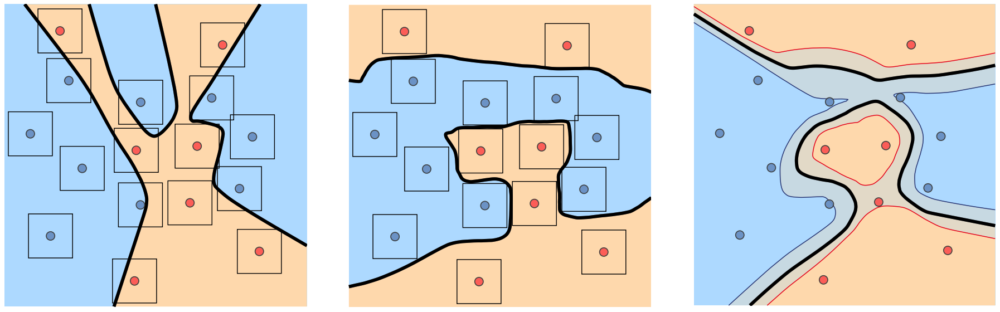

# Controlling Neural Levelsets

<p align="center">
  
</p>


This repository contains an implementation to the Neurips 2019 paper Controlling Neural Level Sets.

This paper presents a simple and scalable approach to directly control level sets of a deep neural network. Our method consists of two parts: (i) sampling of the neural level sets, and (ii) relating the samples' positions to the network parameters. The latter is achieved by a sample network that is constructed by adding a single fixed linear layer to the original network. In turn, the sample network can be used to incorporate the level set samples into a loss function of interest. 

For more details visit: https://arxiv.org/abs/1905.11911.

### Installation Requirmenets
The code is compatible with python 3.7 + pytorch 1.2. In addition, the following packages are required:  
pyhocon, plotly, skimage, trimesh, pandas, advertorch, GPUtil, plyfile.

### Usage
#### Robustness to adversarial examples: 
```
cd ./code
python training_adv/exp_runner.py --conf ./confs/adv/[mnist_or_cifar]_ours.conf
```


jupyter notebook summerizing the results:
  ```
../monitoring/monitor_exps.ipynb
  ```


#### Surface reconstruciton:  
  - Download the faust dataset from http://faust.is.tue.mpg.de/
  
  - According to downloaded path, adjust the variables in preprocess/faust.py
  
  - Preprocessing faust dataset:
  ```
  python preprocess/faust.py
  ```
  
  - Training procedure for the surface reconstruciton task:
  ```
  python training_recon/exp_runner.py --conf ./confs/recon/default.conf
  ```
  
  - Postprocessing of the learned implicit representation, using the marching cubes algorithm (make sure to adjust varairables in file):
  ```
  python training_recon/post_plot_surface.py
  ```

* Outputs are saved in:  
```
../exps/expname/[timestamp]/
```

### Citation
If you find our work useful in your research, please consider citing:

	@article{atzmon2019controlling,
	  title={Controlling Neural Level Sets},
	  author={Atzmon, Matan and Haim, Niv and Yariv, Lior and Israelov, Ofer and Maron, Haggai and Lipman, Yaron},
	  journal={arXiv preprint arXiv:1905.11911},
	  year={2019}
	}

